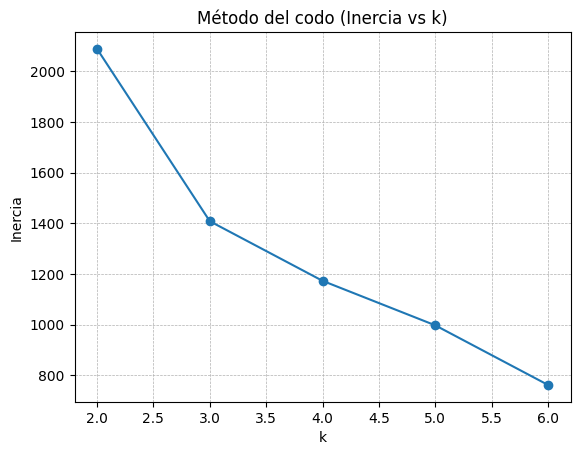
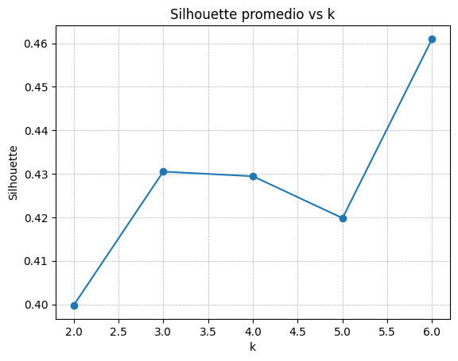

##Alumana Fernandez Ana Maria 
# Clase 8 — Clustering de clientes (K-Means)

## Datos y preparación
- **700 filas × 7 columnas**: 5 variables de comportamiento + 2 columnas de *noise*.
- Escalado con `StandardScaler` (media 0, desvío 1).

## Elección de *k*
- **Codo (k = 2..6):** mejora marginal a partir de 3–4.  
  
- **Silhouette:** pico **≈ 0.461** en **k = 6**.  
  
- **Elección final:** **k = 6**.

## Resultados
- **Centroides en escala original:** `centroides_kmeans.csv`.
- **Patrones clave:**
  - Bandas de **ticket** alrededor de **~90 / ~180 / ~450 USD**.
  - Separación adicional por **frecuencia** (p.ej., ~**12/mes** en alta frecuencia).
- **Visualizaciones:**
  - Scatter `avg_basket_usd` vs `purchase_freq_month` por cluster.  
    
  - **PCA 2D** (buena separación de los 6 clusters).  
    

## Acciones sugeridas (ejemplos)
- **Alta frecuencia + ticket medio:** lealtad, cross-selling, novedades semanales.
- **Ticket alto + baja frecuencia:** bundles premium, reactivación dirigida.
- **Ticket bajo + freq. media/baja:** cupones, descuentos de recompra, recomendaciones en checkout.

## Video (5–7 min)
- ▶️ **Presentación de la actividad:**  
  **[Ver video en Google Drive](https://drive.google.com/file/d/1WemORDxNDlCA3UfL3D2rWfUJZE95iKYS/view?usp=sharing)**

## Archivos del módulo
- `Clase8_KMeans.ipynb`
- `figs/elbow_inercia_k2_a_k6.png`  
- `figs/silhouette_k2_a_k6.png`  
- `figs/scatter_avg_vs_freq_k6.png`  
- `figs/pca2d_k6.png`  
- `centroides_kmeans.csv`  
- `clientes_segmentados_kmeans.csv` *(opcional)*
